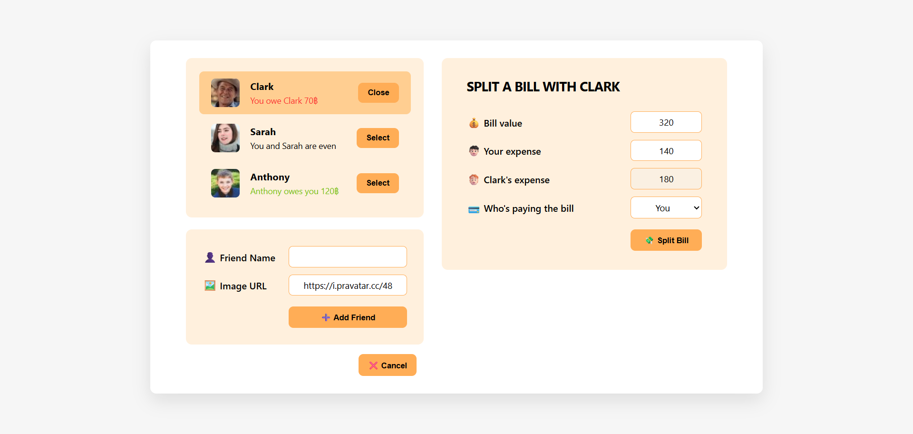

# 💸 Split Bill App

A simple React app to split bills between friends and track who owes whom.

### 🌐 Live Demo

👉 [Try the live Application!](https://nkieu-split-bill.vercel.app/)

---

## 📸 Screenshots



---

## 🚀 Features

- 👥 **Friend List**: View friends and their current balance (who owes whom).
- ➕ **Add New Friend**: Add a new friend with a name and avatar image.
- 🧮 **Split Bill**: Select a friend and split the bill with flexible inputs.
- 💳 **Track Balances**: See real-time updates of money owed or borrowed.
- ✅ **Select/Unselect Friend**: Toggling selection updates the bill form.
- ❌ **Cancel Adding Friend**: Close the add form easily if not needed.

---

## 🧠 Learning Goals

This project was created to reinforce core React concepts:

- **useState** for managing component and app-level state
- **Immutable Updates** using `map()` for arrays
- **Props & Event Handlers**: Parent-child communication
- **Derived State**: Calculate paid-by-friend based on inputs
- **Conditional Rendering**: Render bill form and add form dynamically
- Controlled form inputs: `input`, `select`

---

## 🛠️ Technology Stack

- React (v18+)
- JavaScript (ES6+)
- Vite

---

## 🚀 Installation & Setup

1. **Clone the repository**

   ```bash
   git clone https://github.com/nkieu-config/split-bill-app-project.git
   ```

2. **Install dependencies**

   ```bash
   npm install
   ```

3. **Start development server**

   ```bash
   npm run dev
   ```

⚠️ Requires Node.js and npm installed.

---

## 📚 Course Credit

This project was developed as part of **[The Ultimate React Course 2025](https://www.udemy.com/course/the-ultimate-react-course/)** by [Jonas Schmedtmann](https://codingheroes.io/)

---

## 📃 License

This is a personal learning project and not intended for production use.
